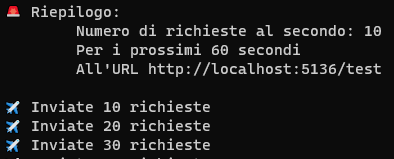
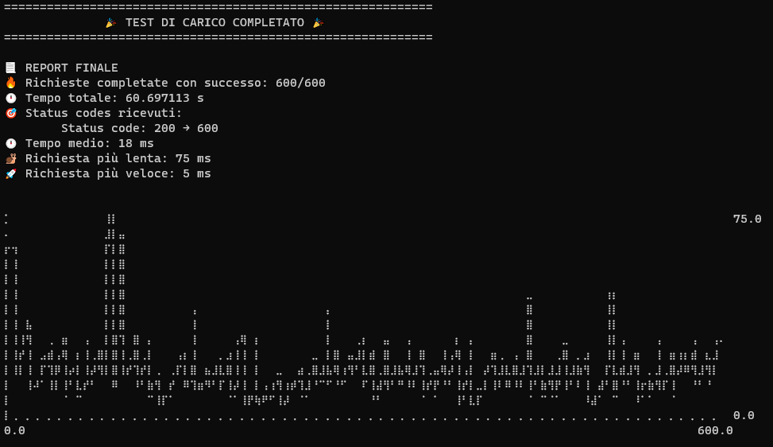

<div id="top"></div>

[![Issues][issues-shield]][issues-url]
[![Release][release-shield]][release-url]
[![MIT License][license-shield]][license-url]
[![Tests][test-shield]][test-url]
[![LinkedIn][linkedin-shield]][linkedin-url]


<br />
<div align="center">

  <h3 align="center">loadhero</h3>

  <p align="center">
    Applicazione CLI per eseguire test di carico
    <br />
    ·
    <a href="https://github.com/mtorromacco/loadhero/issues">Segnala Bug</a>
    ·
    <a href="https://github.com/mtorromacco/loadhero/issues">Richiedi Feature</a>
  </p>
</div>


<details>
  <summary>Indice</summary>
  <ol>
    <li>
      <a href="#descrizione">Descrizione</a>
      <ul>
        <li><a href="#tecnologie-utilizzate">Tecnologie utilizzate</a></li>
      </ul>
    </li>
    <li>
      <a href="#come-iniziare">Come iniziare</a>
      <ul>
        <li><a href="#prerequisiti">Prerequisiti</a></li>
        <li><a href="#installazione">Installazione</a></li>
      </ul>
    </li>
    <li>
      <a href="#utilizzo">Utilizzo</a>
      <ul>
        <li><a href="#argomento">Argomento</a></li>
        <li><a href="#opzioni">Opzioni</a></li>
        <li><a href="#esempi">Esempi</a></li>
      </ul>
    </li>
    <li><a href="#contribuire">Contribuire</a></li>
    <li><a href="#licenza">Licenza</a></li>
  </ol>
</details>


## Descrizione

Applicazione CLI per l'esecuzione di un test di carico su un endpoint API HTTP.
Consente di eseguire un numero di richieste al secondo per un certo periodo di tempo con la possibilità di andare a specificare anche una percentuale di incremento di richieste ad ogni secondo.
E' possibile aggiungere anche headers e/o query strings alle richieste se necessario.


### Tecnologie utilizzate

* [Rust](https://www.rust-lang.org/)


## Come iniziare

E' possibile scaricare l'eseguibile .exe direttamente da [QUI](https://github.com/mtorromacco/loadhero/tags).

### Prerequisiti

Non è necessario alcun prerequisito per poter eseguire l'applicazione.

### Installazione

1. Scarica l'ultima versione dell'applicazione disponibile (attualmente disponibile solo per Windows)
2. Esegui l'applicazione da linea di comando


## Utilizzo

Per poter eseguire l'applicazione è sufficiente lanciarla da CLI con l'argomento e le opzioni necessariamente richieste.

```sh
   > loadhero <ARGOMENTO> <OPZIONI>
```

All'avvio verranno visualizzate lee informazioni del test di carico.

<div align="center">
  <a href="https://github.com/mtorromacco/loadhero">
    
  </a>
</div>

Al termine dell'esecuzione verrà invece visualizzato un report conclusivo.

<div align="center">
  <a href="https://github.com/mtorromacco/loadhero">
    
  </a>
</div>

### Argomento

L'argomento è l'unica informazione obbligatoria che l'applicazione richiede e corrisponde all'URL assoluto dell'endpoint da testare.

```sh
   > loadhero "http://localhost:5136/test"
```

### Opzioni

E' possibile andare a definire molteplici opzioni per l'esecuzione del programma:
* --help → Fornisce supporto per argomento ed opzioni disponibili
```sh
   > loadhero --help
```
* -V | --version → Versione dell'applicazione
```sh
   > loadhero --version
```
* -r | --requests-per-second → Consente di specificare il numero di richieste al secondo da eseguire (default 10)
```sh
   > loadhero "http://localhost:5136/test" -r 150
```
* -s | --seconds → Permette di specificare il numero di secondi di esecuzione del test di carico (default 60)
```sh
   > loadhero "http://localhost:5136/test" -s 30
```
* -i | --increment → Consente di indicare un incremento in percentuale del numero di richieste che avvengono ogni secondo (default 0)
```sh
   > loadhero "http://localhost:5136/test" -i 5
```
* -h | --header → Permette di aggiungere un header alle richieste (è possibile indicarne anche più di uno)
```sh
   > loadhero "http://localhost:5136/test" -h "content-type=application/json" -h "authorization=xyz"
```
* -q | --query-string → Permette di aggiungere una query string alle richieste (è possibile indicarne anche più di una)
```sh
   > loadhero "http://localhost:5136/test" -q "name=matteo" -q "age=25"
```

### Esempi

Eseguo un test di carico sull'URL indicato con 10 richieste al secondo per 60 secondi (default).

```sh
   > loadhero "http://localhost:5136/test"
```

Eseguo un test di carico sull'URL indicato con 150 richieste al secondo per 30 secondi.

```sh
   > loadhero "http://localhost:5136/test" -r 150 -s 30
```

Eseguo un test di carico sull'URL indicato con 10 richieste al secondo per 60 secondi (default) ma ad oogni secondo che passa eseguo un incremento del 5% sul numero di richieste eseguite.

```sh
   > loadhero "http://localhost:5136/test" -i 5
```

Eseguo un test di carico sull'URL indicato con 10 richieste al secondo per 60 secondi (default) aggiungendo ad ogni richieste l'header "authorization".

```sh
   > loadhero "http://localhost:5136/test" -h "authorization=xyz"
```

Eseguo un test di carico sull'URL indicato con 10 richieste al secondo per 60 secondi (default) aggiungendo ad ogni richieste la query string "name".

```sh
   > loadhero "http://localhost:5136/test" -q "name=matteo"
```

Eseguo un test di carico sull'URL indicato con tutte le opzioni viste precedentemente.

```sh
   > loadhero "http://localhost:5136/test" -r 150 -s 30 -i 5 -h "authorization=xyz" -q "name=matteo"
```

## Contribuire

I contributi sono ciò che rende la comunità open source un magnifico posto per imparare, ispirare e creare. Qualsiasi contributo sarà **molto apprezzato**.

Se hai un suggerimento per rendere l'applicazione migliore, per favore crea un fork del progetto e poi una pull request oppure apri una issue anche solo per un consiglio.

Processo:

1. Fork del progetto
2. Crea il tuo feature branch (`git checkout -b feature/MyFeatures`)
3. Commit delle modifiche (`git commit -m 'Aggiunte alcune features'`)
4. Push sul branch (`git push origin feature/MyFeatures`)
5. Apri una pull request


## Licenza

Distributed under the MIT License. See `LICENSE.txt` for more information.

<p align="right">(<a href="#top">Torna in alto</a>)</p>


[issues-shield]: https://img.shields.io/github/issues/mtorromacco/loadhero.svg?style=for-the-badge
[issues-url]: https://github.com/mtorromacco/loadhero/issues

[release-shield]: https://img.shields.io/github/v/release/mtorromacco/loadhero.svg?display_name=tag&style=for-the-badge
[release-url]: https://github.com/mtorromacco/loadhero/releases

[license-shield]: https://img.shields.io/badge/License-MIT-yellow.svg?style=for-the-badge
[license-url]: https://opensource.org/licenses/MIT
	
[test-shield]: https://img.shields.io/github/workflow/status/mtorromacco/loadhero/Rust/master.svg?style=for-the-badge 
[test-url]: https://github.com/mtorromacco/loadhero/actions/workflows/tests.yml

[linkedin-shield]: https://img.shields.io/badge/-LinkedIn-black.svg?logo=linkedin&colorB=555&style=for-the-badge
[linkedin-url]: https://linkedin.com/in/matteo-torromacco
